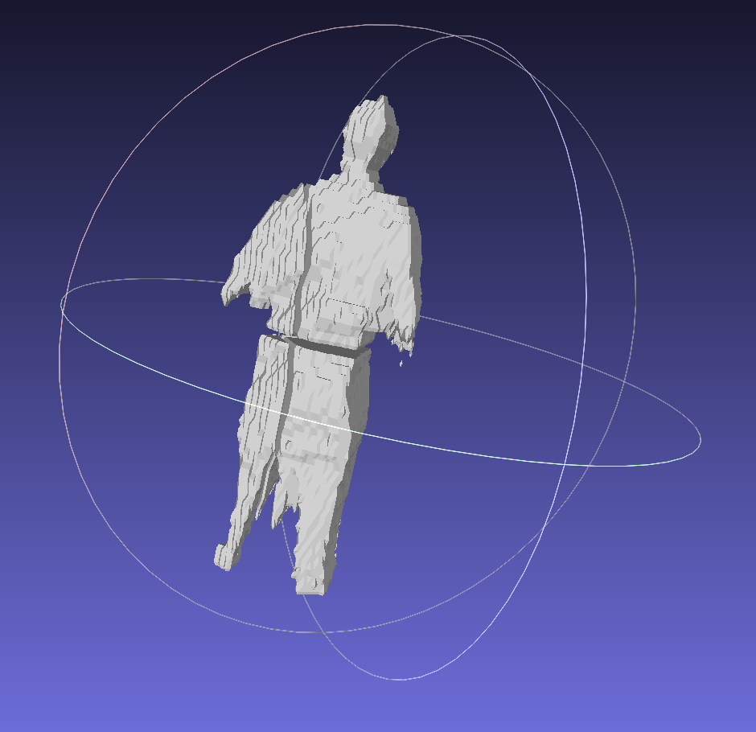
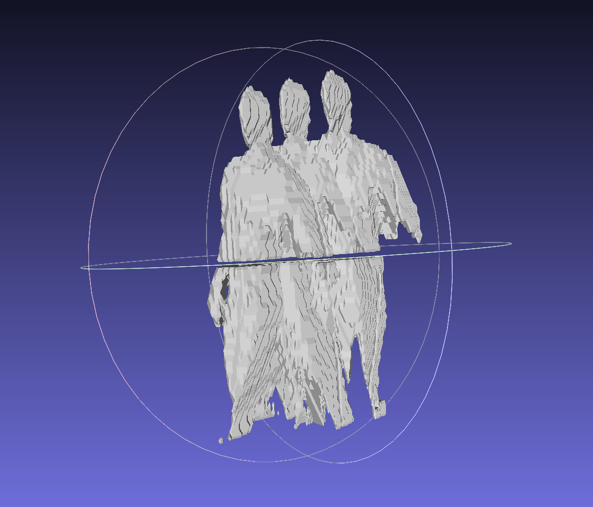

# Real-time 3D Object Tracking with Frustum Projection

The current script can be found [here](code/script_sam.py). A testbed notebook can be found [here](code/testing.ipynb)

The repository does not contain the `.mp4` video sequences captured from multiple views and also the pretrained object detection model.

## Updates:
- **10/12/2024**: Updated code with denser representation for object tracking via space carving and segmentation-aware 3D object detection. The module implementing the above can be found [here](code/dense_recon.py) and the code with this integration can be found [here](code/script_sam.py). The results are shown below.

Human Mesh result after applying marching cubes over the voxel grid obtained from space carving of the segmented mask.

3D Object Tracking result with the updated method on a video sequence with 3 chosen frames which are 8 frames apart.